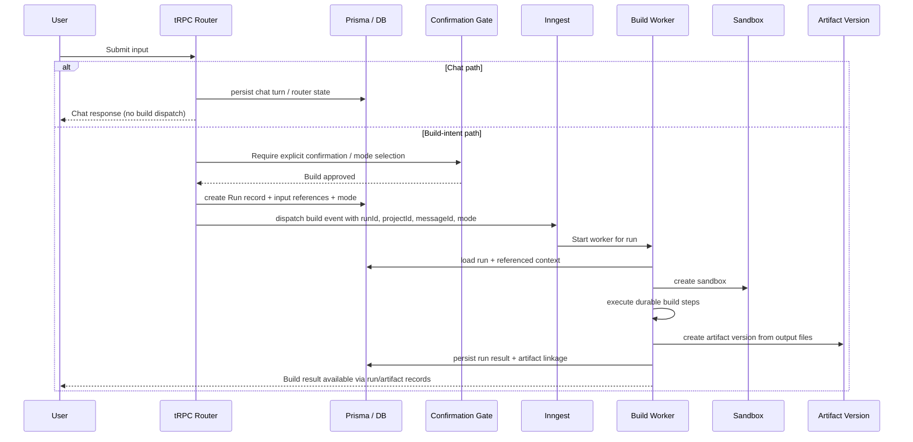

# P0 Inngest Audit and Keep/Change Matrix

## 1. Overview
This audit documents the current Inngest-triggered build flow in Lambda, covering both `inngest.send` trigger callsites, the `code-agent/run` worker implementation, all known database side effects, and the main durability, correctness, and architecture risks relevant to the Router→Worker migration described in initiative #19. The goal is to capture what should be preserved, what should be changed, and where the current system creates operational or product risk.

## 2. Trigger Inventory
| Callsite | File:Line | Procedure Tier | Pre-dispatch DB Writes | Event Name | Payload Shape | Error Handling |
|---|---|---|---|---|---|---|
| Project creation flow | `src/modules/projects/server/procedures.ts:76` | `usageProtectedProcedure` | `prisma.project.create` with nested `Message` (`role=USER`, `type=RESULT`) | `code-agent/run` | `{ value: string, projectId: string }` | On `inngest.send` failure, deletes created project via `prisma.project.delete({ where: { id: createdProject.id } })` |
| Follow-up message flow | `src/modules/messages/server/procedures.ts:70` | `usageProtectedProcedure` | Ownership check, then `prisma.message.create` (`role=USER`, `type=RESULT`) | `code-agent/run` | `{ value: string, projectId: string }` | No rollback on `inngest.send` failure; USER message remains persisted |

## 3. Worker Step Breakdown
| Step Name | What It Does | External Call | DB Read/Write | Durable (`step.run`)? | Notes |
|---|---|---|---|---|---|
| `get-sandbox-id` | Creates a sandbox for the run and returns `sandboxId` | `Sandbox.create("lambda")`, sets `SANDBOX_TIMEOUT` | None | Yes | First durable step; sandbox lifecycle begins here |
| `get-previous-messages` | Loads last 5 messages for the project, reverses them, formats as `Message[]` | None beyond Prisma client | Read: `prisma.message.findMany({ where: { projectId }, orderBy: { createdAt: "desc" }, take: 5 })` | Yes | Hardcoded 5-message limit; worker context rebuilt from DB rather than event payload |
| `createState<AgentState>` | Initializes agent state with empty summary and files plus prior messages | None | None | No | Pure in-memory setup before network execution |
| `createNetwork` / `codeAgent` | Runs the main AgentKit network with `gpt-5-mini`, `maxIter: 15` | LLM call to `codeAgent` | None directly | No | Router stops when `summary` is set; otherwise continues to `codeAgent` |
| `terminal` tool | Runs terminal commands inside sandbox | `sandbox.commands.run(command)` | None | Yes | Wrapped via `step.run("terminal")`; sandbox side effects occur outside DB |
| `createOrUpdateFiles` tool | Writes one or more files into sandbox and updates in-memory `files` map | `sandbox.files.write` repeated `N` times | None | Yes | Durable wrapper, but resulting file map lives in network state until `save-result` |
| `readFiles` tool | Reads files from sandbox | `sandbox.files.read` repeated `N` times | None | Yes | Durable wrapper for file reads |
| `onResponse` lifecycle | Captures `<task_summary>` output and writes summary into network state | LLM response hook | None | No | Sentinel-driven parsing is fragile; governs router termination |
| `fragmentTitleGenerator.run(...)` | Generates fragment title from summary using `gpt-5-mini` | LLM call | None | No | Not wrapped in `step.run`; re-executes on retry |
| `responseGenerator.run(...)` | Generates user-facing response from summary using `gpt-5-mini` | LLM call | None | No | Not wrapped in `step.run`; re-executes on retry |
| `get-sandbox-url` | Resolves public sandbox URL | `sandbox.getHost(3000)` and formats `https://${host}` | None | Yes | Assumes app exposed on port `3000` |
| `save-result` | Persists either error message or successful assistant result with fragment | Prisma writes | Write: `prisma.message.create(...)`; on success also nested `fragment.create` | Yes | `isError = !summary || Object.keys(files).length === 0`; no dedupe/idempotency guard |

## 4. DB Side Effects
| Model | Operation | When | Owned By | Rollback Exists? |
|---|---|---|---|---|
| `Project` | `create` | Triggered by project creation flow before dispatch | `projects.create` trigger | Yes, if `inngest.send` fails |
| `Message` | Nested `create` (`role=USER`, `type=RESULT`) | Alongside project creation before dispatch | `projects.create` trigger | Yes, indirectly via project deletion |
| `Message` | `create` (`role=USER`, `type=RESULT`) | Triggered by follow-up message flow before dispatch | `messages.create` trigger | No |
| `Message` | `findMany` (last 5) | Worker context load before network run | `get-previous-messages` worker step | Not applicable |
| `Message` | `create` (`role=ASSISTANT`, `type=ERROR`) | `save-result` when `summary` missing or `files` empty | `save-result` worker step | No |
| `Message` | `create` (`role=ASSISTANT`, `type=RESULT`) | `save-result` when `summary` present and files non-empty | `save-result` worker step | No |
| `Fragment` | Nested `create` with `sandboxUrl`, `title`, `files` | On successful `save-result` | `save-result` worker step | No |

## 5. Keep / Change Matrix
| Component | Decision | Rationale |
|---|---|---|
| E2B sandbox creation | Keep with changes | Sandbox-per-run is aligned with build isolation, but lifecycle metadata should move onto an explicit run record and be tied to durable orchestration semantics |
| `terminal` tool | Keep | Executing commands in the sandbox is core to build execution and should remain part of the worker surface |
| `createOrUpdateFiles` tool | Keep | Writing generated files is a necessary build capability and maps directly to artifact creation |
| `readFiles` tool | Keep | Reading sandbox files is required for agent iteration and verification |
| AgentKit network (`gpt-5-mini`) | Change | The agent loop is useful, but it should be reframed behind Router→Worker boundaries with explicit run state, stronger completion signals, and better retry/idempotency guarantees |
| `<task_summary>` sentinel pattern | Change | Parsing raw model output for a sentinel is brittle and can fail silently or produce false positives; completion should use structured state or explicit tool/result channels |
| `fragmentTitleGenerator` | Change | Post-network title generation is reasonable, but it must be made durable or folded into a deterministic post-processing stage to avoid retry drift |
| `responseGenerator` | Change | Same issue as title generation; current non-durable execution can re-run inconsistently on retry |
| `get-previous-messages` (5-msg limit) | Change | Rehydrating only five messages is a hardcoded context cap that may truncate important state; target architecture should use explicit router state or configurable history selection |
| Event name `code-agent/run` | Change | A single event name hides whether the run came from new-project creation or follow-up continuation, which complicates routing, analytics, and evolution toward Chat/Build modes |
| Event payload shape | Change | Payload lacks `messageId`, run identity, trigger type, and mode; worker must re-query context indirectly instead of consuming explicit input references |
| `save-result` DB write | Keep with changes | Persisting an assistant result is correct, but it needs idempotency protection and probably should attach to a first-class run/artifact record |
| `projects.create` rollback | Keep | Rolling back pre-dispatch writes on failed dispatch is correct and should be preserved |
| `messages.create` (no rollback) | Change | Persisting orphaned USER messages on dispatch failure creates inconsistent history and should be replaced with rollback or deferred commit semantics |
| `usageProtectedProcedure` gating | Keep | Usage-based access control/gating belongs at the trigger boundary and should remain in place |
| Step durability pattern | Keep with changes | Durable `step.run` boundaries are the right mechanism, but they are currently applied inconsistently across the workflow |
| Post-network agents (non-durable) | Change | Any model-driven post-processing that affects persisted output must be moved under durable steps or made deterministic |

## 6. Sequence Diagrams (Mermaid)

### Diagram A - Current Flow
```mermaid
sequenceDiagram
    participant U as User
    participant T as tRPC Procedure
    participant DB as Prisma / DB
    participant I as Inngest
    participant W as codeAgentFunction Worker
    participant S as E2B Sandbox
    participant L as LLM / AgentKit

    U->>T: Create project or send follow-up message
    alt projects.create
        T->>DB: create Project + nested USER Message
        T->>I: inngest.send("code-agent/run", { value, projectId })
        alt send fails
            T->>DB: delete Project
        end
    else messages.create
        T->>DB: create USER Message
        T->>I: inngest.send("code-agent/run", { value, projectId })
        alt send fails
            Note over T,DB: No rollback; USER message persists
        end
    end

    I->>W: Trigger code-agent/run
    W->>S: step.run("get-sandbox-id") / Sandbox.create("lambda")
    W->>DB: step.run("get-previous-messages") / findMany(last 5)
    W->>L: createNetwork(codeAgent, gpt-5-mini, maxIter 15)
    loop Agent iteration
        L->>W: terminal / createOrUpdateFiles / readFiles
        alt terminal
            W->>S: step.run("terminal") / commands.run(...)
        else createOrUpdateFiles
            W->>S: step.run("createOrUpdateFiles") / files.write(...)
        else readFiles
            W->>S: step.run("readFiles") / files.read(...)
        end
        L->>W: raw output containing optional <task_summary>
    end

    W->>L: fragmentTitleGenerator.run(summary)
    W->>L: responseGenerator.run(summary)
    W->>S: step.run("get-sandbox-url") / getHost(3000)
    alt summary missing or files empty
        W->>DB: step.run("save-result") / create ASSISTANT ERROR message
    else success
        W->>DB: step.run("save-result") / create ASSISTANT RESULT + Fragment
    end
```

### Diagram B - Target Router-Worker Flow


## 7. Gap and Risk Register
- `P0` No rollback in `messages.create` when `inngest.send` fails. Mitigation: wrap pre-dispatch message persistence in rollback logic or defer durable write until dispatch succeeds.
- `P0` `fragmentTitleGenerator.run` and `responseGenerator.run` are not wrapped in `step.run`, so retries can regenerate different outputs. Mitigation: move both into durable steps or compute them deterministically from persisted state.
- `P0` No deduplication/idempotency guard around `save-result`, so retries can create duplicate assistant messages. Mitigation: introduce a run record with unique constraint or idempotency key and make final write upsert-like.
- `P1` Event payload lacks `messageId`, trigger type, mode, and run identity. Mitigation: expand payload to include explicit references and routing metadata.
- `P1` Worker reconstructs context from DB using a hardcoded 5-message history window. Mitigation: replace with explicit router-selected context or configurable history policy.
- `P1` `<task_summary>` sentinel in raw model output is fragile and can break completion detection. Mitigation: use structured outputs, explicit tool returns, or dedicated state mutation channels.
- `P1` Single event name `code-agent/run` covers both new-project and follow-up flows, preventing branch-specific behavior and observability. Mitigation: split event types or include a required trigger discriminator.
- `P2` Success is inferred from `summary` presence and non-empty `files`, which may not fully capture build correctness. Mitigation: introduce explicit run status and artifact validation criteria.
- `P2` Sandbox URL generation assumes port `3000` and immediate host availability. Mitigation: store declared service port in run metadata or validate exposed app state before persisting success.

## 8. Acceptance Checklist
- [x] Every `inngest.send` callsite documented
- [x] Every DB side effect of worker documented
- [x] Keep/Change matrix complete
- [x] Sequence diagrams cover current and target flows
